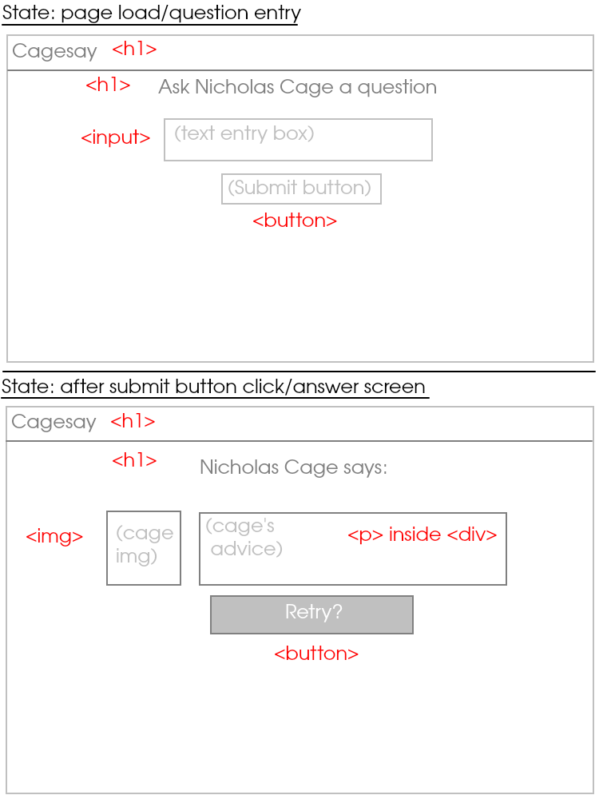

# Magic Cage Ball

Nicholas Cage gives you advice

## Wireframe

## States

- user input/ask question state
- cage response state

## CSS Classes

- **show**: apply to elements to display for current state
- **hide**: apply to elements to hide for current state

## HTML elements to DOM-grab

- put each element for each state in a big 
, then apply `hide` and `show` classes to the divs containing elements for each state; the changes will cascade down
- 
 containing cage's response
- buttons
- <input> for user entered text
